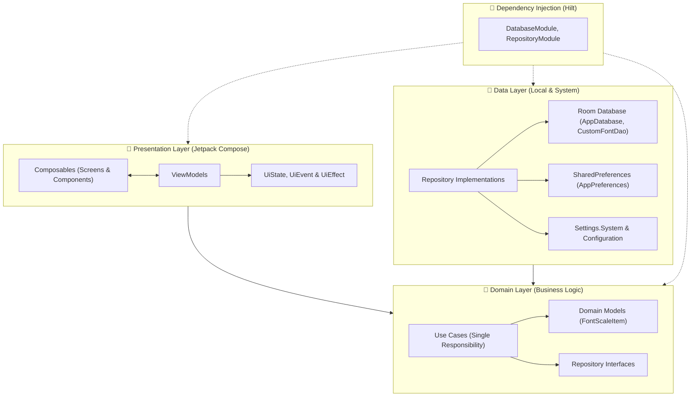

# 🔍 Big Font & Text Magnifier (Phóng To Chữ Hệ Thống) 📱

<p align="center">
  
</p>

<p align="center">
  <b>Ứng dụng Android thay đổi kích thước chữ toàn hệ thống, tùy biến font chữ và tích hợp kính lúp máy ảnh, được xây dựng theo kiến trúc Clean Architecture với Jetpack Compose hiện đại.</b>
</p>

<p align="center">
  <a href="https://kotlinlang.org/"></a>
  <a href="https://developer.android.com/jetpack/compose"></a>
  <a href="https://dagger.dev/hilt/"></a>
  <a href="https://developer.android.com/training/data-storage/room"></a>
  <a href="https://developer.android.com/training/camerax"></a>
  <a href="https://developer.android.com/about/versions/oreo"></a>
  <a href="https://developer.android.com/"></a>
</p>

---

## 📖 Giới thiệu (Overview)

**Big Font & Text Magnifier** là giải pháp hỗ trợ thị giác toàn diện trên Android dành cho người lớn tuổi, người có tật khúc xạ mắt hoặc bất kỳ ai muốn đọc văn bản trên điện thoại một cách dễ dàng, thoải mái mà không bị mỏi mắt.

Ứng dụng cho phép phóng to toàn bộ kích thước phông chữ của hệ điều hành Android từ **100% lên đến 240%+**, cung cấp công cụ thanh trượt điều chỉnh kích thước linh hoạt, lưu trữ các cỡ font yêu thích vào cơ sở dữ liệu và tích hợp kính lúp soi chữ với máy ảnh trợ sáng đèn flash tiện lợi.

---

## ✨ Tính năng nổi bật (Key Features)

- 🔤 **Phóng to chữ toàn hệ thống (System Font Scaler)**: Thay đổi kích thước chữ cho tất cả ứng dụng, danh bạ, tin nhắn, cài đặt hệ thống từ 100% (1.0x) đến 240%+ (2.4x) chỉ với một thao tác chạm.
- 👁️ **Xem trước trực quan theo thời gian thực (Live Text Preview)**: Mỗi mức font đều có đoạn văn bản mẫu phóng to tương ứng theo tỷ lệ thực tế, giúp người dùng dễ dàng chọn cỡ chữ ưng ý nhất.
- ✏️ **Tùy chỉnh cỡ chữ theo ý muốn (Custom Size Slider)**: Thanh trượt linh hoạt từ **70% đến 280%** với độ chính xác cao. Tự động lưu các mức chữ tùy chỉnh vào cơ sở dữ liệu Room để tái sử dụng lâu dài.
- 🔍 **Kính lúp soi chữ thông minh (CameraX Magnifier)**: Sử dụng máy ảnh sau với độ phóng đại từ **1.0x đến 5.0x**, tích hợp công tắc bật/tắt **Đèn pin (Torch)** giúp đọc chữ nhỏ trên bao bì thuốc, hóa đơn, sách báo trong điều kiện thiếu sáng.
- 📱 **Tiện ích Màn hình chính (Quick Scale AppWidget)**: Hỗ trợ widget ngoài màn hình chính với **Jetpack Glance**, cho phép chuyển đổi nhanh các mức cỡ chữ mà không cần mở ứng dụng.
- 🛡️ **Khóa mật độ hiển thị an toàn (Anti-Broken Layout)**: Cơ chế khóa tỷ lệ `LocalDensity(fontScale = 1.0f)` bên trong giao diện ứng dụng, đảm bảo các nút bấm và bố cục không bị phình to vỡ nát khi người dùng kích hoạt font cỡ lớn toàn hệ thống.
- 🗑️ **Quản lý danh sách font linh hoạt**: Cho phép xóa bỏ các cỡ chữ tự tạo bất cứ lúc nào, tự động nhận diện mức font hiện tại của máy để hiển thị trạng thái "Đang dùng".
- ⚙️ **Cài đặt & Tương tác thuận tiện**: Tích hợp đánh giá 5 sao trên Google Play, chia sẻ app cho người thân, gửi email đóng góp ý kiến tự động đính kèm thông tin thiết bị và liên kết chính sách bảo mật.

---

## 🏛️ Kiến trúc dự án (Architecture)

Dự án áp dụng chặt chẽ mô hình **Clean Architecture** kết hợp mô hình **MVI / MVVM (Model-View-Intent / ViewModel)** nhằm đảm bảo tính độc lập, dễ bảo trì, dễ mở rộng và hỗ trợ viết Unit Test hiệu quả:



### Các tầng trong hệ thống:
1. **Presentation Layer**:
   - Xây dựng 100% bằng **Jetpack Compose** theo phong cách Declarative UI với Material 3.
   - Quản lý trạng thái thông qua `UiState`, tiếp nhận hành động người dùng qua `UiEvent` và xử lý các sự kiện một lần (One-shot event) như cấp quyền, mở màn hình hệ thống qua `UiEffect` (Coroutines Channel).
   - Điều hướng toàn bộ các luồng màn hình với `Navigation Compose` (`AppNavHost`).
2. **Domain Layer**:
   - Chứa các `UseCase` thực thi từng nghiệp vụ độc lập: `GetFontScalesUseCase`, `ApplyFontScaleUseCase`, `CheckWritePermissionUseCase`, `SaveCustomFontUseCase`, `DeleteCustomFontUseCase`, `PrepareInitialDataUseCase`, `CompleteIntroUseCase`.
   - Hoàn toàn độc lập với Android Framework và cơ sở dữ liệu.
3. **Data Layer**:
   - **Room Database (KSP Kotlin Generation)**: Lưu trữ và đồng bộ hóa các cỡ chữ tùy chỉnh của người dùng thông qua Reactive `Flow`.
   - **FontScaleRepositoryImpl**: Đọc thông số `Configuration.fontScale`, kiểm tra quyền hệ thống `Settings.System.canWrite()`, và ghi đè giá trị `Settings.System.FONT_SCALE`.
   - **AppPreferences**: Lưu trữ trạng thái người dùng (hoàn thành Onboarding/Intro).
4. **Dependency Injection**:
   - Sử dụng **Dagger Hilt** (`@HiltAndroidApp`, `@AndroidEntryPoint`, `@HiltViewModel`) để quản lý vòng đời và tiêm phụ thuộc cho toàn bộ ứng dụng.

---

## 📁 Cấu trúc thư mục (Project Structure)

```text
com.thupo.bigfont/
├── App.kt                               # Application class (@HiltAndroidApp)
├── MainActivity.kt                      # Single Activity với Jetpack Compose Host
├── data/
│   ├── local/
│   │   ├── AppDatabase.kt               # Room Database
│   │   ├── dao/
│   │   │   └── CustomFontDao.kt         # Data Access Object quản lý font tùy chỉnh
│   │   └── entity/
│   │       └── CustomFontEntity.kt      # Entity bảng custom_fonts
│   ├── pref/
│   │   └── AppPreferences.kt            # Quản lý SharedPreferences
│   └── repository/
│       ├── FontScaleRepositoryImpl.kt   # Hiện thực hóa quản lý font scale & Settings.System
│       └── UserPreferencesRepositoryImpl.kt
├── di/
│   ├── DatabaseModule.kt                # Hilt Module cung cấp Room Database & DAO
│   └── RepositoryModule.kt              # Hilt Module binds Repository Interfaces
├── domain/
│   ├── model/
│   │   └── FontScaleItem.kt             # Model biểu diễn thông tin mức cỡ chữ
│   ├── repository/
│   │   ├── FontScaleRepository.kt       # Interface quản lý font scale
│   │   └── UserPreferencesRepository.kt
│   ├── usecase/
│   │   ├── ApplyFontScaleUseCase.kt     # UseCase áp dụng font vào hệ thống
│   │   ├── CheckWritePermissionUseCase.kt # UseCase kiểm tra quyền WRITE_SETTINGS
│   │   ├── CompleteIntroUseCase.kt      # UseCase đánh dấu hoàn thành Intro
│   │   ├── DeleteCustomFontUseCase.kt   # UseCase xóa font tùy chỉnh khỏi Room
│   │   ├── GetFontScalesUseCase.kt      # UseCase lấy danh sách font phản ứng qua Flow
│   │   ├── PrepareInitialDataUseCase.kt # UseCase kiểm tra điều hướng ban đầu
│   │   └── SaveCustomFontUseCase.kt     # UseCase lưu font tùy chỉnh vào Room
│   └── util/
│       └── FontScaleHelper.kt           # Helper tính toán & đọc tỷ lệ font hệ thống
├── presentation/
│   ├── components/
│   │   ├── FontScaleCard.kt             # Card hiển thị & xem trước font scale
│   │   ├── HomeQuickActions.kt          # Cụm 2 nút hành động: Tùy chỉnh & Kính lúp
│   │   └── IntroPageItem.kt             # Item trang giới thiệu Onboarding
│   ├── navigation/
│   │   ├── AppNavHost.kt                # Host điều hướng chính của ứng dụng
│   │   └── Screen.kt                    # Định nghĩa Sealed Class các Routes
│   ├── screen/
│   │   ├── custom/                      # Màn hình thanh trượt tạo cỡ chữ tùy chọn
│   │   ├── home/                        # Màn hình chính danh sách font scale
│   │   ├── intro/                       # Màn hình Onboarding hướng dẫn lần đầu
│   │   ├── magnifier/                   # Màn hình Kính lúp phóng đại với CameraX
│   │   ├── setting/                     # Màn hình Cài đặt, Đánh giá, Phản hồi
│   │   └── splash/                      # Màn hình Splash khởi động
│   └── widget/
│       ├── FontScaleWidget.kt           # Jetpack Glance Widget màn hình chính
│       └── FontScaleWidgetReceiver.kt   # BroadcastReceiver cho AppWidget
└── ui/theme/                            # Color, Theme, Type (Jetpack Compose Material 3)
```

---

## 🛠️ Công nghệ & Thư viện (Tech Stack)

| Thành phần | Công nghệ / Thư viện | Phiên bản |
| :--- | :--- | :--- |
| **Ngôn ngữ** | Kotlin | 2.2.10 |
| **UI Framework** | Jetpack Compose BOM | 2026.02.01 |
| **Design System** | Material 3 & Extended Icons | - |
| **Architecture** | Clean Architecture + MVI/MVVM | - |
| **Dependency Injection** | Dagger Hilt | 2.60.1 |
| **Database** | Room Database (KSP Kotlin Gen) | 2.6.1 |
| **Camera & Flash** | CameraX (Camera2, Lifecycle, View) | 1.4.1 |
| **Home AppWidget** | Jetpack Glance Material 3 | 1.1.1 |
| **Xử lý bất đồng bộ** | Kotlin Coroutines & Flow | 1.9.0 |
| **Tải ảnh & Animation** | Coil Compose / Lottie Compose | 2.7.0 / 6.6.0 |
| **Navigation** | Navigation Compose & Hilt Navigation | 1.2.0 |
| **Build Tool** | Android Gradle Plugin (AGP) / Gradle KTS | 9.1.1 |

---

## 🚀 Hướng dẫn cài đặt & Chạy ứng dụng (Getting Started)

### Yêu cầu môi trường:
- **Android Studio**: Ladybug / Meerkat / Koala hoặc mới hơn.
- **JDK**: Java Development Kit 17 hoặc 21.
- **Android SDK**:
  - `minSdk`: **26** (Android 8.0 Oreo)
  - `targetSdk`: **36** (Android 16+)
  - `compileSdk`: **36**

### Các bước cài đặt:

1. **Clone repository về máy:**
   ```bash
   git clone https://github.com/DoAnhThu832004/Big-Font.git
   ```

2. **Mở dự án trong Android Studio:**
   - Chọn `File` -> `Open...` và trỏ tới thư mục vừa clone.
   - Đợi Android Studio đồng bộ Gradle (Gradle Sync) và nạp đầy đủ dependencies.

3. **Build & Run:**
   - Chọn thiết bị thử nghiệm (Thiết bị thật hoặc Máy ảo Android 8.0+).
   - Nhấn nút **Run ▶️** (hoặc tổ hợp phím `Shift + F10` trên Windows / `Control + R` trên macOS).

   *Hoặc build APK Debug bằng dòng lệnh:*
   ```bash
   # Trên Windows PowerShell:
   .\gradlew.bat assembleDebug

   # Trên macOS / Linux:
   ./gradlew assembleDebug
   ```
   File APK sẽ được tạo tại đường dẫn: `app/build/outputs/apk/debug/app-debug.apk`.

---

## 🔒 Quyền hạn ứng dụng (Permissions)

Ứng dụng chỉ sử dụng các quyền cần thiết tối thiểu nhằm phục vụ các tính năng cốt lõi:
- `android.permission.WRITE_SETTINGS`: Quyền cấp hệ thống bắt buộc để thay đổi cài đặt kích thước phông chữ toàn điện thoại (`Settings.System.FONT_SCALE`). Ứng dụng tự động điều hướng người dùng tới trang cấp quyền hệ thống nếu chưa được bật.
- `android.permission.CAMERA`: Dùng để vận hành máy ảnh phục vụ tính năng **Kính lúp soi chữ (Magnifier)**.

---

## 🤝 Đóng góp (Contributing)

Mọi ý kiến đóng góp, báo cáo lỗi (issues) hoặc pull request đều rất được hoan nghênh:
1. Fork dự án
2. Tạo nhánh tính năng mới (`git checkout -b feature/AmazingFeature`)
3. Commit thay đổi (`git commit -m 'Add some AmazingFeature'`)
4. Push lên nhánh của bạn (`git push origin feature/AmazingFeature`)
5. Mở một Pull Request trên GitHub

---

## 👤 Tác giả (Author)

- **DoAnhThu832004** - [GitHub Profile](https://github.com/DoAnhThu832004)
- **Repository**: [Big-Font](https://github.com/DoAnhThu832004/Big-Font)

---

<p align="center">⭐ Đừng quên tặng 1 sao cho dự án nếu bạn thấy hữu ích nhé! ⭐</p>
